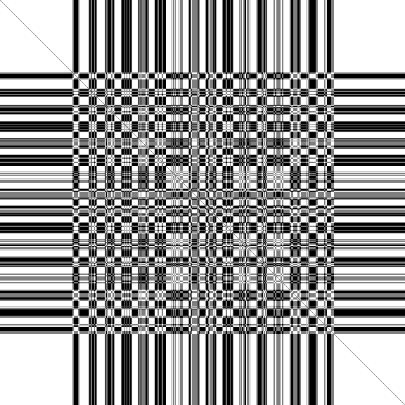

# Boltzmann Machine & Hopfield Network in C++

|  |   |  |
|----------------------|------------------------|------------------------|

A simple C++ implementation of a Hopfield Network with Hebbian learning rules and Generalised Boltzmann Machine with Contrastive Learning.

### Hopfield Network

We structure $n$ images with $p$ binary pixels each into an $n\times p$ matrix called $M\in\{-1,1\}^{n\times p}$ (memory). The goal of a Hopfield network with weights $W\in\mathbb{R}^{p\times p}$ is to sample a vector $\vec{s}\in\{-1,1\}^p$ from this data distribution to minimize the total energy $E$,

$$E=-\frac{1}{2}\vec{s}^\top W\vec{s}$$

We can do this by initializing the network weights according to the Hebbian learning rule,

$$W = \frac{1}{n}M^\top M$$

and setting the weights along the diagonal to 0.

To run inference, we initialize a state vector $\vec{s}\in\mathbb{R}^p$ with random integer entries between -2 and 2 and iteratively update random entries of $\vec{s}$ according to the following rule,

$$s_i= \begin{cases}
1, &         \vec{s}\cdot W_i \ge0,\\
-1, &         \text{otherwise}
\end{cases}$$

where $W_i$ refers to column $i$ of the weight matrix.

### Boltzmann Machines

Boltzmann machines introduce significantly more stochasticity into the learning and inference processes compared to Hopfield networks and can be used to learn more complex data.

|   |  |  |  |
|----------------------------|-------------------------------|---------------------------|------------------------|
| Boltzmann Machine          | Hopfield Network              | Boltzmann Machine         | Hopfield Network       |

The Boltzmann machine's state is defined by  visible neurons $\vec{v}\in \{0,1\}^D$ and hidden neurons $\vec{h}\in \{0,1\}^K$. Its parameters are the following weights,

1. visible-to-visible neurons $A\in\mathbb{R}^{D\times D}$
2. hidden-to-hidden neurons $B\in\mathbb{R}^{K\times K}$
3. visible-to-hidden neurons $W\in\mathbb{R}^{D\times K}$

and biases,

1. visible neuron biases $\vec{a}\in\mathbb{R}^D$
2. hidden neurons biases $\vec{b}\in\mathbb{R}^K$

We wish to minimize the following energy function:

$$E=-\frac{1}{2}\vec{v}^\top A\vec{v} - \frac{1}{2}\vec{h}^\top B\vec{h} - \frac{1}{2}\vec{v}^\top W\vec{h} - \vec{a}^\top\vec{v} - \vec{b}^\top\vec{h}$$

The weight matrices are initialized with a Gaussian distribution,

$$A_{ij} \thicksim \mathcal{N}\left(0,\frac{1}{\sqrt{D+K}}\right)$$

and have their diagonals set to zero. Unlike the deterministic training of the Hopfield network, the Boltzmann machine has a stochastic training passes where the parameters are optimised through a gradient-descent-like process.
