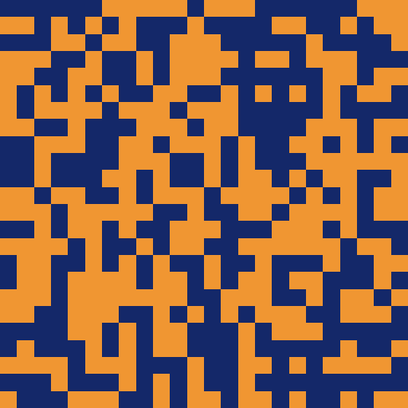

# Boltzmann Machines & Hopfield Network in C++

|  |   |  |
|---------------|------------------------|------------------------|

Simple C++ implementations of a Hopfield Network with Hebbian learning rules and Generalized Boltzmann Machine, and Restricted Boltzmann Machine with Contrastive Divergence trained on the MNIST dataset.

```[commandline]
Usage: ./main [OPTIONS]

Options:
  --help                  Show this help message and exit
  --model, -m <type>      Choose model type: 'hopfield', 'boltzmann', or 'rbm' (default: rbm)
  --train, -t <type>      'true' for training, 'false' for inference (default: true)
  --data, -d  <string>    Path to .npy file containing training data
  --name <string>         Output/input filename without extension (e.g. 'mnist_rbm')
  --epochs, -e <int>      Number of training epochs (e.g., 20)
  --batch_size, -b <int>  Batch size for training (e.g., 256)
  --hidden, -n <int>      Number of hidden neurons (e.g., 100)
  --cd_k, -k <int>        Number of Contrastive Divergence steps (e.g., 10)
  --lr, -l <float>        Learning rate (e.g., 0.05)
  --momentum, -p <float>  Momentum for gradient update (e.g., 0.5)
  --w_std, -w <float>     Standard deviation for initializing weights (e.g., 0.1)
  --x_mean, -x <float>    Mean for initializing visible bias (e.g., -0.2)
  --h_mean, -h <float>    Mean for initializing hidden bias (e.g., -0.5)
```

For example, to train a Restricted Boltzmann Machine on the default dataset:
```
./main --model rbm --epochs 20 --batch_size 64 --cd_k 2 --lr 0.05
```

And then to run inference on the trained model:
```
./main --model rbm --train false
```

## Hopfield Network

We structure $n$ images with $p$ binary pixels each into an $n\times p$ matrix called $M\in\{-1,1\}^{n\times p}$ (memory). The goal of a Hopfield network with weights $W\inℝ^{p\times p}$ is to sample a vector $s\in\{-1,1\}^p$ from this data distribution to minimize the total energy $E$,

$$E=-\frac{1}{2} s^\top W s$$

We can do this by initializing the network weights according to the Hebbian learning rule,

$$W = \frac{1}{n}M^\top M$$

and setting the weights along the diagonal to 0.

To run inference, we initialize a state vector $s\inℝ^p$ with random integer entries between -2 and 2 and iteratively update random entries of $s$ according to the following rule,

$$s_i= \begin{cases}
1, &          s^\top W_i \ge0,\\
-1, &         \text{otherwise}
\end{cases}$$

where $W_i$ refers to column $i$ of the weight matrix.

## Boltzmann Machines

A Boltzmann Machine (BM) introduces significantly more stochasticity into the learning and inference processes compared to Hopfield networks and can be used to learn more complex data.

|   |  |  |  |
|----------------------------|-------------------------------|---------------------------|------------------------|
| Boltzmann Machine          | Hopfield Network              | Boltzmann Machine         | Hopfield Network       |

The Boltzmann machine's state is defined by  visible neurons $v\in \{0,1\}^D$ and hidden neurons $h\in \{0,1\}^K$. Its parameters are the following weights,

1. visible-to-visible neurons $A\inℝ^{D\times D}$
2. hidden-to-hidden neurons $B\inℝ^{K\times K}$
3. visible-to-hidden neurons $W\inℝ^{D\times K}$

and biases,

1. visible neuron biases $a\inℝ^D$
2. hidden neurons biases $b\inℝ^K$

We wish to minimize the following energy function:

$$E=-\frac{1}{2} v^\top A v - \frac{1}{2} h^\top B h - \frac{1}{2} v^\top W h -  a^\top v -  b^\top h$$

The weight matrices are initialized with a Gaussian distribution,

$$A_{ij} \thicksim \mathcal{N}\left(0,\frac{1}{\sqrt{D+K}}\right)$$

and have their diagonals set to zero. Unlike the deterministic training of the Hopfield network, the Boltzmann machine follows a gradient-descent-like process.

#### Inference

Inference is very similar to the Hopfield network, but with a more stochastic update rule,

$$v_i= \begin{cases}
1, &         \text{with probability } \sigma\left(\frac{1}{T}\left( h^\top W_i +  v^\top A_i + a_i\right)\right)\\
0 &         
\end{cases}$$

$$h_j= \begin{cases}
1, &         \text{with probability } \sigma\left(\frac{1}{T}\left( v^\top W_{,j} +  h^\top B_j + b_j\right)\right)\\
0 &         
\end{cases}$$

where $\sigma$ is the sigmoid function and $T$ is a temperature parameter which controls the amount of randomness. As $T\rightarrow0$, the model achieves behaviour similar to a Hopfield network and as $T$ grows, it becomes more random.

## Restricted Boltzmann Machines

|  |   |
|---------------------|---------------------------------------------|
| MNIST Model Filters | Randomly Generated MNIST Outputs            |

Boltzmann machines do not perform very well unless constrained. A Restricted Boltzmann Machine (RBM) is created by eliminating connections between the same class (i.e. visible/hidden) neurons. This is equivalent to letting $A=0$ and $B=0$.

The new energy function is to minimize is

$$E= - \frac{1}{2} v^\top W h -  a^\top v -  b^\top h$$

By removing inter-class connections, we can also greatly speed up the training process by updating all the hidden/visible neurons at once.


Inference is almost identical to the Boltzmann Network with the new update rules

$$v_i= \begin{cases}
1, &         \text{with probability } \sigma\left(\frac{1}{T}\left( h^\top W_i + a_i\right)\right)\\
0 &         
\end{cases}$$

$$h_j= \begin{cases}
1, &         \text{with probability } \sigma\left(\frac{1}{T}\left( v^\top W_{,j} + b_j\right)\right)\\
0 &         
\end{cases}$$

Note that since the probabilities of updating the visible/hidden neurons only depend on the hidden/visible neurons, we can parallize the updates and make the learning process faster.
